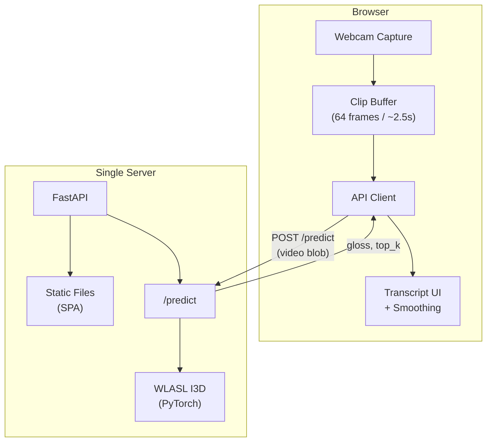
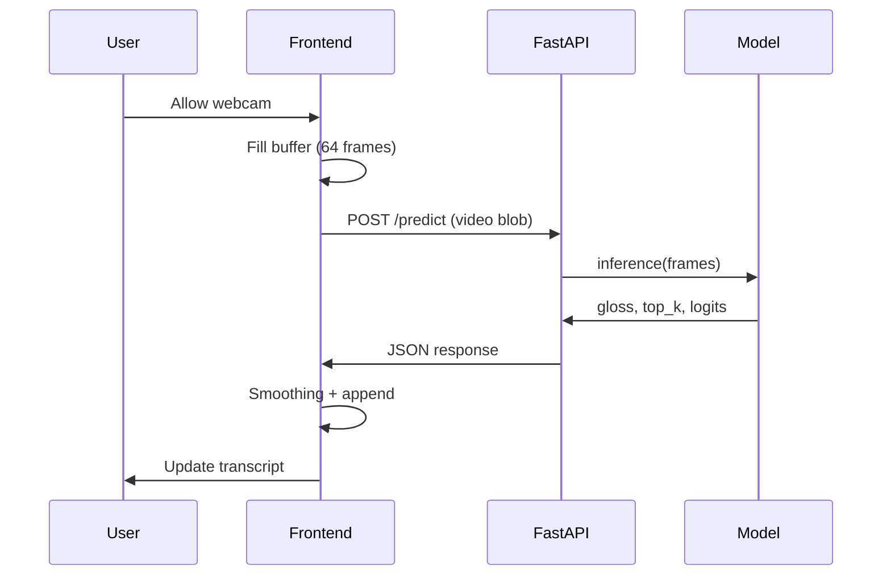

# Sign Language Real-Time Interpretation App — Architecture

Single-server design: FastAPI backend serves both the API and the built frontend. One deployment, one origin.

---

## Architecture diagram


---

## High-level architecture (ASCII)

```
┌─────────────────────────────────────────────────────────────────────────────┐
│                              BROWSER (User)                                  │
│  ┌───────────────────────────────────────────────────────────────────────┐  │
│  │                         Frontend (SPA)                                 │  │
│  │  ┌─────────────┐  ┌─────────────┐  ┌─────────────┐  ┌─────────────┐  │  │
│  │  │   Webcam    │  │  Clip       │  │  API Client │  │  Transcript │  │  │
│  │  │   Capture   │──│  Buffer     │──│  (fetch/    │──│  UI +       │  │  │
│  │  │             │  │  (e.g. 64   │  │   WS)       │  │  Smoothing  │  │  │
│  │  │             │  │  frames)    │  │             │  │             │  │  │
│  │  └─────────────┘  └─────────────┘  └──────┬──────┘  └─────────────┘  │  │
│  └──────────────────────────────────────────┼──────────────────────────┘  │
└──────────────────────────────────────────────┼──────────────────────────────┘
                                               │ HTTPS (same origin)
                                               ▼
┌─────────────────────────────────────────────────────────────────────────────┐
│                         SINGLE SERVER (e.g. VM / Container)                 │
│  ┌───────────────────────────────────────────────────────────────────────┐  │
│  │                         FastAPI App                                    │  │
│  │  ┌─────────────┐  ┌─────────────┐  ┌─────────────────────────────────┐ │  │
│  │  │  Static     │  │  /predict   │  │  Model (WLASL I3D)               │ │  │
│  │  │  Files      │  │  endpoint   │  │  load once, infer per request   │ │  │
│  │  │  (SPA)      │  │             │  │  → gloss(es) + confidence       │ │  │
│  │  └─────────────┘  └──────┬──────┘  └─────────────────────────────────┘ │  │
│  └──────────────────────────┼─────────────────────────────────────────────┘  │
└─────────────────────────────┼────────────────────────────────────────────────┘
                              │
                    Request: video clip (or frame bundle)
                    Response: { "gloss": "...", "top_k": [...], "confidence": ... }
```

---

## Component diagram (Mermaid)



---

## Data flow

1. **Browser:** User allows webcam → frontend captures frames into a rolling buffer (e.g. 64 frames @ 25 fps ≈ 2.5 s).
2. **Frontend:** On a timer or “segment” trigger, sends the clip to `POST /predict` (e.g. as `multipart/form-data` video or frame list).
3. **Backend:** Receives clip → decodes → samples 64 frames → runs WLASL I3D → returns `{ "gloss": "book", "top_k": ["book", "all", ...], "confidence": 0.42 }`.
4. **Frontend:** Applies smoothing (e.g. debounce, majority vote), appends to transcript, updates UI.
5. **Optional:** Same server serves the SPA at `/` and API at `/predict` (same origin).

---

## Directory layout (suggested)

```
sign_language_app/
├── backend/                 # FastAPI app
│   ├── app/
│   │   ├── main.py          # FastAPI app, mount static, /predict
│   │   ├── inference.py     # Load model, run inference (reuse wlasl_i3d)
│   │   └── config.py       # Paths, num_classes, etc.
│   ├── requirements.txt
│   └── ...
├── frontend/                # SPA (e.g. React + Vite)
│   ├── src/
│   │   ├── App.tsx
│   │   ├── components/      # Webcam, Transcript, Controls
│   │   └── api/             # client for /predict
│   ├── package.json
│   └── dist/                # build output (served by FastAPI)
├── wlasl_i3d/               # Existing model code
├── dataset/                 # Existing data
├── pretrained_weights/     # Checkpoints
└── docs/
    └── ARCHITECTURE.md      # This file
```

---

## Sequence diagram (request/response)



---

## Deployment (single server)

- **Run:** One process (e.g. `uvicorn app.main:app`) or one Docker image.
- **Static:** After `npm run build`, point FastAPI at `frontend/dist` (or equivalent) so `GET /` serves the SPA; API remains at `/predict`, `/health`, etc.
- **Scaling:** Later you can put a load balancer in front of multiple backend replicas; frontend stays static or on a CDN.

This gives you a clear, single-server architecture with a diagram you can open in any Mermaid-capable viewer (GitHub, VS Code, etc.).
